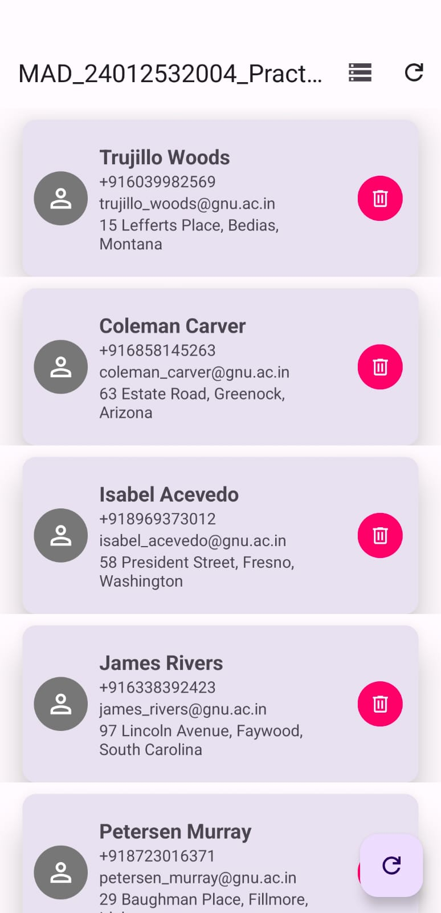
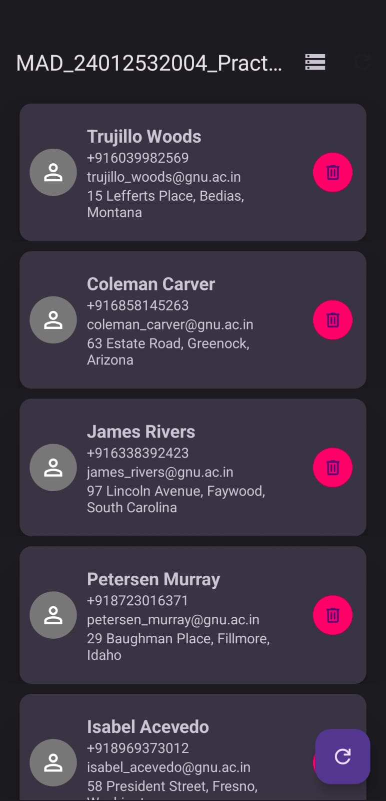

# SQLite and JSON Practical

This Android application demonstrates how to retrieve person data in JSON format from an internet API and store the retrieved data in an SQLite database.

## AIM

Develop an Android application that retrieves person data in JSON format from an internet API and stores the retrieved data in an SQLite database.

## Features

*   Fetches person data from a remote JSON API.
*   Parses the JSON data and displays it in a RecyclerView.
*   Stores the fetched data in a local SQLite database.
*   Supports both light and dark themes.
*   Allows users to switch between viewing data from the local database and fetching fresh data from the network.
*   Users can delete individual records.

## How to Use

1.  **Launch the app:** The app will initially load data from the local SQLite database.
2.  **Fetch from Network:** Tap the "Nw Db" (Network Database) icon in the toolbar to fetch fresh data from the JSON API. The new data will be displayed and saved to the local database.
3.  **Fetch from SQLite:** Tap the "SQLite Db" icon in the toolbar to load data from the local SQLite database.
4.  **Delete a record:** Tap the trash can icon next to a person's details to delete that record from the list and the local database.

## Screenshots

|                                   Light Theme                                    |                                   Dark Theme                                   |
|:--------------------------------------------------------------------------------:|:------------------------------------------------------------------------------:|
|  |  |

